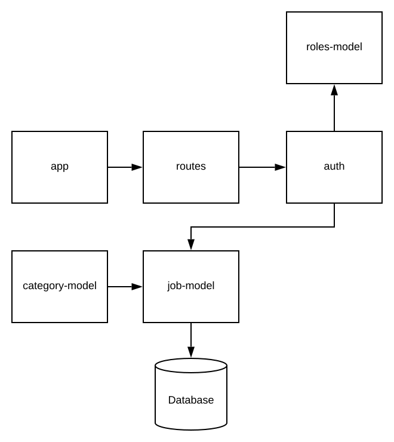

# 401 Mid term project

# Authors 

- Lindsay Pelltier
- Natalie Alway
- Travis Skyles 
- Trevor Thompson
- David Vloedman

## Job management and bidding system

Our project aims to allow users to be able to post jobs. Other users can then post a bid to do the job.
The creator can accept bids and then close the job.The user has privledges over their own jobs. Admin users 
also exist and have privledges to all jobs.

### MVPs

* Have users be able to make accounts and have accounts persist
* Have users be able to login with their creditentials and have authorization to their privledge set
for a set amount of time without having to login again
* Have users be able to create, update, delete and accept bids for a job
* Have users be able to bid on other users jobs
* Have a superuser role that can have privledges over all jobs

#### Stretch

* Have users be notified of activity through email or sms on their jobs and jobs they have bid.
* Implement graphql 
* Inter-user messaging

### Trello Board

* [Trello](https://trello.com/b/dom2QnVY/projectone)

### Requirements

* [User Stores](./requirements.md)

### Diagram

