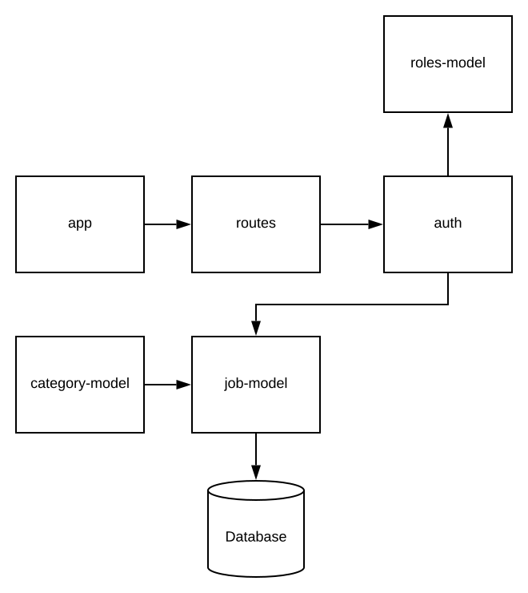
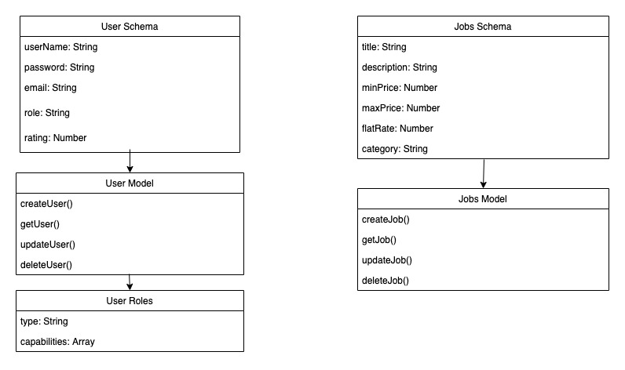

# 401 Mid term project

# Authors 

- Lindsay Pelltier
- Natalie Alway
- Travis Skyles 
- Trevor Thompson
- David Vloedman

## Problem Domain
Do you need help moving? mowing your lawn? setting up ikea furniture? There are not alot of options to find handy help. Our application can assist you in your search to find handy people across the nation! Our application will allows a user to login or signup using an Oauthorization process, once in our application that user will be able to post job requests. They will be able to have a role that can create a job, update the information, or delete the job posting. Other users are able to browse the job postings and "bid" to do the job.

## Job management and bidding system

Our project aims to allow users to be able to post jobs. Other users can then post a bid to do the job.
The creator can accept bids and then close the job.The user has privledges over their own jobs. Admin users 
also exist and have privledges to all jobs.

### MVPs

* Have users be able to make accounts and have accounts persist
* Have users be able to login with their creditentials and have authorization to their privledge set
for a set amount of time without having to login again
* Have users be able to create, update, delete and accept bids for a job
* Have users be able to bid on other users jobs
* Have a superuser role that can have privledges over all jobs
* Have users be notified of activity through email on their jobs and jobs they have bid.

#### Stretch

* Implement graphql 
* Inter-user messaging

### Deployment

* [Heroku](https://git.heroku.com/kan-u.git)

### Trello Board

* [Trello](https://trello.com/b/dom2QnVY/projectone)

### Requirements

* [User Stores](./projectDocs/requirements.md)

### Diagrams

#### Data flow

#### Domain 

